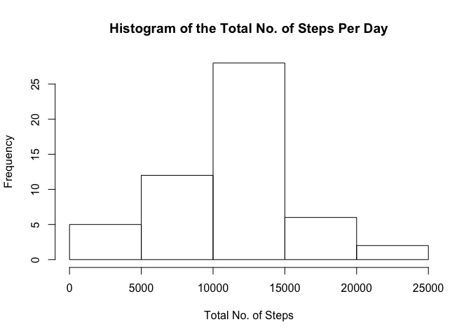
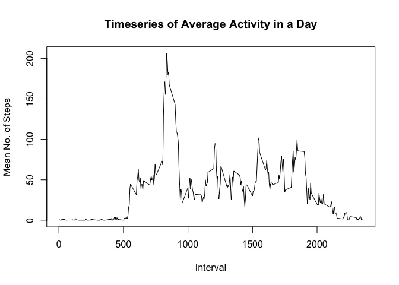
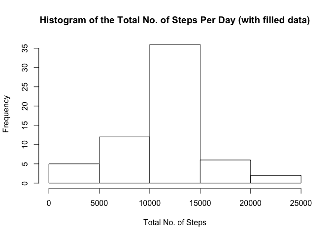

# Reproducible Research: Peer Assessment 1


## Loading and preprocessing the data

In order to load the relevant data for this analysis and visualization exercise, 
we take the zip file titled *activity.zip* in the working directory and unzip it
with the command,


```r
if (file.exists("activity.zip")) {
  unzip("activity.zip")
} else {print("The data zip file doesn't exist!")}
```

Of course note that an important preliminary query (shown above) is to make sure 
the zip file actually exists in your working directory! Next, we load the data 
from the uncompressed csv file to the R environment, title the loaded dataset 
*activity*, and then delete the *activity.csv* in order to conserve space on the 
local hard drive:


```r
activity <- read.csv("activity.csv", header=TRUE)
file.remove("activity.csv")
```

Here’s a quick summary of the data from both ends,


```r
head(activity)
```

```
##   steps       date interval
## 1    NA 2012-10-01        0
## 2    NA 2012-10-01        5
## 3    NA 2012-10-01       10
## 4    NA 2012-10-01       15
## 5    NA 2012-10-01       20
## 6    NA 2012-10-01       25
```

```r
tail(activity)
```

```
##       steps       date interval
## 17563    NA 2012-11-30     2330
## 17564    NA 2012-11-30     2335
## 17565    NA 2012-11-30     2340
## 17566    NA 2012-11-30     2345
## 17567    NA 2012-11-30     2350
## 17568    NA 2012-11-30     2355
```

For the most part, the data is in a form suitable for analysis. In some cases it 
may be advantageous to ignore missing or *NA* values in the data, we will 
highlight such cases as they apply to each of the following questions. Ahead of
such cases, we create a new version of *activity* with no *NA* values and title
the reduced dataset *activity.no.NA*,


```r
activity.no.NA <- activity[is.na(activity$steps)==FALSE,]
```

Here’s a quick summary of reduced dataset *activity.no.NA* from both ends, 


```r
head(activity.no.NA)
```

```
##     steps       date interval
## 289     0 2012-10-02        0
## 290     0 2012-10-02        5
## 291     0 2012-10-02       10
## 292     0 2012-10-02       15
## 293     0 2012-10-02       20
## 294     0 2012-10-02       25
```

```r
tail(activity.no.NA)
```

```
##       steps       date interval
## 17275     0 2012-11-29     2330
## 17276     0 2012-11-29     2335
## 17277     0 2012-11-29     2340
## 17278     0 2012-11-29     2345
## 17279     0 2012-11-29     2350
## 17280     0 2012-11-29     2355
```

## What is mean total number of steps taken per day?

We ignore missing values when addressing this question. In order to calculate 
the total number of steps taken per day, we aggregate by summing the data from 
the *steps* variable and use the *date* variable as the unique identifier,


```r
tot.activity.day <- aggregate(activity.no.NA$steps, by=list(activity.no.NA$date)
                              ,sum)
names(tot.activity.day) <- c("date","steps")
```

The following histogram visualizes the total number of steps taken per day,


```r
hist(tot.activity.day$steps,
     main = "Histogram of the Total No. of Steps Per Day",
     xlab="Total No. of Steps")
```

 

The corresponding mean and median of the total number of steps taken per day is 
calculated using,


```r
mean.tot <- round(mean(tot.activity.day$steps),2)
median.tot <- round(median(tot.activity.day$steps),2)
```

Thus the **mean is 10766.19** and the corresponding 
**median is 10765**.

## What is the average daily activity pattern?

In order to address this question, we aggregate by averaging the data from the 
*steps* variable and use the *interval* variable as the unique identifier,


```r
avg.activity.int <- aggregate(activity.no.NA$steps, 
                              by=list(activity.no.NA$interval),mean)
names(avg.activity.int) <- c("interval","steps")
```

Note that we are still using the dataset with no *NA* values. Now we create a 
time series plot in order to visualize the average number of steps taken per 
5-minute interval over the 2-month period,


```r
plot(avg.activity.int$interval,avg.activity.int$steps,type="l",
     main="Timeseries of Average Activity in a Day",xlab="Interval",
     ylab="Mean No. of Steps")
```

 

From the looks of the above diagram, the maximum number of steps (on average 
across all the days in the dataset) occurs between the 750^th^ and 1000^th^ 
minute marker. Just to be sure, we calculate the maximum average number of steps 
from the aggregated data and link it with the corresponding 5-minute interval 
marker,


```r
max.int <- avg.activity.int$interval[which.max(avg.activity.int$steps)]
```

**The 5-minute interval with the maximum average number of steps is the 
835^th^ interval**.

## Inputing missing values

Now our aim is to specifically deal with the *NA* values in the original 
dataset, if any (I know, I know, it's too late for suspense). First let’s start 
off by checking and calculating the total number of NA values in the data set. 
Since the *date* and *interval* variables are factor variables we can actually 
limit our search for *NA* values to the only numeric variable, *steps*,


```r
na.rows <- which(is.na(activity$steps)==TRUE)
num.na.rows <- length(na.rows)
```

**There are a total of 2304 missing values in the dataset**. *NA* values 
can bias results from statistical analyses, so it may be advantageous to 
substitute a guesstimated value in place of the *NA*s (bearing in mind such a 
substitution could sometimes lead to further miscalculation). **In place of the 
*NA*s, let's substitute the mean values corresponding to a given 5-minute 
interval**,


```r
filled.activity <- activity

for (i in 1:num.na.rows) {
  ind <- which(filled.activity$interval[na.rows[i]]==avg.activity.int$interval)
  filled.activity$steps[na.rows[i]] <- avg.activity.int$steps[ind]
}
```

Note that we call the new filled dataset *filled.activity*. Let's quickly check 
out samples of the data to make sure to make sure the *NA* values, particularly 
at the top and bottom of the dataset, now take on the average for that time 
interval,


```r
head(filled.activity)
```

```
##       steps       date interval
## 1 1.7169811 2012-10-01        0
## 2 0.3396226 2012-10-01        5
## 3 0.1320755 2012-10-01       10
## 4 0.1509434 2012-10-01       15
## 5 0.0754717 2012-10-01       20
## 6 2.0943396 2012-10-01       25
```

```r
tail(filled.activity)
```

```
##           steps       date interval
## 17563 2.6037736 2012-11-30     2330
## 17564 4.6981132 2012-11-30     2335
## 17565 3.3018868 2012-11-30     2340
## 17566 0.6415094 2012-11-30     2345
## 17567 0.2264151 2012-11-30     2350
## 17568 1.0754717 2012-11-30     2355
```

Nice! Time to compare summaries of the filled dataset with the original dataset.
We make a histogram of the total number of steps taken each day using *filled.activity*


```r
tot.filled.activity.day <- aggregate(filled.activity$steps, by=list(filled.activity$date)
                              ,sum)
names(tot.filled.activity.day) <- c("date","steps")
hist(tot.filled.activity.day$steps,
     main = "Histogram of the Total No. of Steps Per Day (with filled data)",
     xlab="Total No. of Steps")
```

 

Note that the max frequency of this histogram is greater than that of the 
previous histogram, this makes sense given that we just added values to days 
that previously held *NA* values. The corresponding mean and median of the total 
number of steps taken per day (with the filled dataset) is calculated using,


```r
mean.tot.filled <- round(mean(tot.filled.activity.day$steps),2)
median.tot.filled <- round(median(tot.filled.activity.day$steps),2)
```

Thus the **mean is 10766.19** and the corresponding 
**median is 10766.19**. **The mean value looks to be the same as 
the mean from the first part of the assignment. However the median in this 
exercise is greater than the median of the first part. Furthermore, the inputing 
guesstimate values make the new histogram more symmetric, which lead to 
identical mean and median.** 

## Are there differences in activity patterns between weekdays and weekends?

In addressing this question, we’ll use the *filled.activity* dataset. Our aim is 
to distinguish weekend activity from weekday activity, then quantify and visualize 
those differences. First we create a new factor variable, called *day*, which 
indicates whether a given date is a "weekday" or "weekend" day,


```r
filled.activity$day <- weekdays(as.Date(filled.activity$date))
filled.activity$day[filled.activity$day %in% 
                      c("Monday","Tuesday","Wednesday","Thursday","Friday")] <- 
                        "weekday"
filled.activity$day[filled.activity$day %in% c("Saturday","Sunday")]<-"weekend"
```

We know that that October 1^st^, 2012 was a Monday and October 7^th^, 2012 was a sunday; let's check out the *day* variable for these two dates to make sure the above transformation is accurate,


```r
filled.activity$day[filled.activity$date=="2012-10-01"][1]
```

```
## [1] "weekday"
```

```r
filled.activity$day[filled.activity$date=="2012-10-07"][1]
```

```
## [1] "weekend"
```

Awesome! Now we have all the relevant info to create time series plots for the 
average number of steps taken per 5-minute interval and stratify by the type of 
*day*. First we break the data apart based on whether it pertains to a 
"weekend" or "weekday", 


```r
filled.activity.wday <- filled.activity[filled.activity$day=="weekday",]
filled.activity.wend <- filled.activity[filled.activity$day=="weekend",]
```

then we aggregate the separate datasets by calculating the mean steps per 5-minute interval. 


```r
avg.filled.activity.wday <- aggregate(filled.activity.wday$steps, 
                                      by=list(filled.activity.wday$interval),
                                      mean)
avg.filled.activity.wend <- aggregate(filled.activity.wend$steps, 
                                      by=list(filled.activity.wend$interval),
                                      mean)

avg.filled.activity.wend$day <- rep("weekend",nrow(avg.filled.activity.wend))
avg.filled.activity.wday$day <- rep("weekday",nrow(avg.filled.activity.wday))
```

Finally we re-bind the two datasets. 


```r
avg.filled.activity <- rbind(avg.filled.activity.wend,avg.filled.activity.wday)
names(avg.filled.activity) <- c("interval","steps","day")
```

Now we can use the 
[lattice](http://cran.r-project.org/web/packages/lattice/index.html) 
package in R to produce the following timseries panel plot,


```r
library(lattice)

xyplot(steps~interval|day,data = avg.filled.activity,type="l",xlab="Interval",
       ylab="Number of steps",layout=c(1,2))
```

 

##FINITO!
